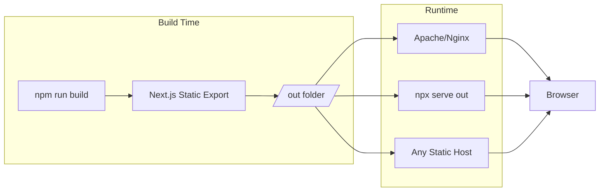
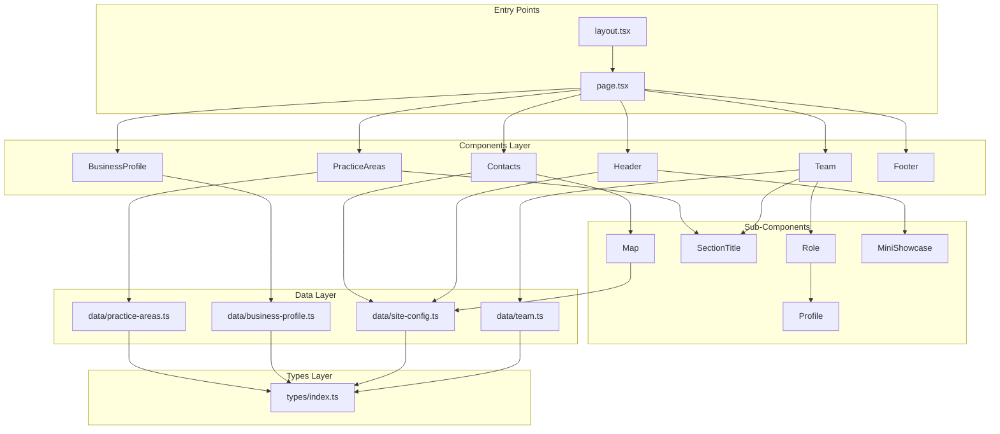
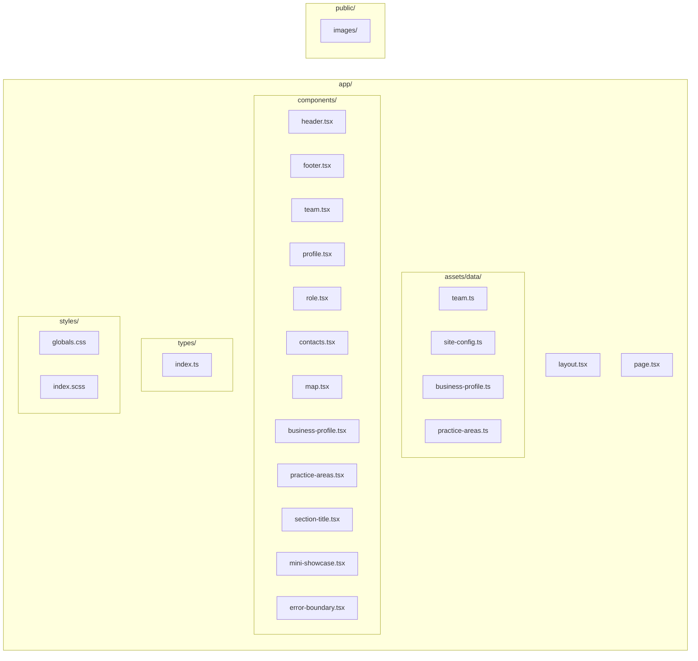

# LYS Law Firm Website

A professional law firm website built with Next.js 16, React 19, and Tailwind CSS. This project follows **SOLID principles** and **Clean Code** practices for maintainability and scalability.

## Tech Stack

- **Next.js 16** - React framework with static export
- **React 19** - UI library
- **TypeScript** - Type safety
- **Tailwind CSS** - Utility-first styling
- **SCSS** - Additional styling (minimal)
- **Google Maps API** - Office location map
- **React Icons** - Icon library

## Getting Started

### Prerequisites

- Node.js 18+
- npm or pnpm

### Installation

```bash
npm install
```

### Development

```bash
npm run dev
```

Open [http://localhost:3000](http://localhost:3000) to view in browser.

### Production Build

```bash
npm run build
```

Static files are generated in `/out` folder, ready for Apache/Nginx deployment.

### Preview Build Locally

```bash
npx serve out
```

Open [http://localhost:3000](http://localhost:3000) to preview the static build.

## Static Site Architecture

This website is **statically generated** - no server-side runtime required. Next.js pre-renders all pages at build time into plain HTML, CSS, and JavaScript files.



### Why Static?

| Benefit | Description |
|---------|-------------|
| **Fast** | Pre-built HTML loads instantly |
| **Secure** | No server-side code to exploit |
| **Cheap** | Host anywhere (Apache, Nginx, CDN) |
| **Simple** | Just upload files - no Node.js server needed |

### Local Preview

After running `npm run build`, preview the static output:

```bash
npx serve out
```

This simulates how the site will behave on your production Apache/Nginx server.

## Project Architecture



## File Structure



## Directory Structure

```
lys-lf-react-19/
├── app/
│   ├── assets/
│   │   └── data/           # Centralized data (SRP)
│   │       ├── team.ts           # Employee data
│   │       ├── site-config.ts    # Contact, map, social config
│   │       ├── business-profile.ts # Firm description
│   │       └── practice-areas.ts # Legal services offered
│   │
│   ├── components/         # React components
│   │   ├── header.tsx           # Hero section with branding
│   │   ├── footer.tsx           # Site footer
│   │   ├── team.tsx             # Team section container
│   │   ├── role.tsx             # Role group (Partners/Associates)
│   │   ├── profile.tsx          # Individual team member card
│   │   ├── business-profile.tsx # About the firm section
│   │   ├── practice-areas.tsx   # Legal services grid
│   │   ├── contacts.tsx         # Contact info + map
│   │   ├── map.tsx              # Google Maps integration
│   │   ├── section-title.tsx    # Reusable section header
│   │   ├── mini-showcase.tsx    # Image showcase component
│   │   └── error-boundary.tsx   # Error handling wrapper
│   │
│   ├── types/
│   │   └── index.ts        # Centralized TypeScript interfaces
│   │
│   ├── styles/
│   │   ├── globals.css     # Tailwind imports + CSS vars
│   │   └── index.scss      # Minimal global styles
│   │
│   ├── layout.tsx          # Root layout with metadata
│   └── page.tsx            # Main page component
│
├── public/
│   └── images/             # Static images
│
├── out/                    # Static export (after build)
├── tailwind.config.js      # Tailwind + brand colors
├── next.config.ts          # Next.js configuration
└── tsconfig.json           # TypeScript configuration
```

## SOLID Principles Applied

### Single Responsibility Principle (SRP)

Each module has one reason to change:

| Module | Responsibility |
|--------|----------------|
| `data/team.ts` | Employee data only |
| `data/site-config.ts` | Site-wide configuration only |
| `data/business-profile.ts` | Firm description content only |
| `types/index.ts` | Type definitions only |
| `components/*.tsx` | Presentation only |

**Before refactoring:**
```tsx
// ❌ team.tsx had data + presentation mixed
const Team = () => {
  const partners = [
    { name: 'John', pic: '/img.jpg', ... },  // Data here!
  ];
  return <div>...</div>;
};
```

**After refactoring:**
```tsx
// ✅ Data extracted to data/team.ts
// team.tsx now only handles presentation
import { partners, associates } from '@/app/assets/data/team';

const Team = () => {
  return <div>...</div>;  // Presentation only
};
```

### Open/Closed Principle (OCP)

The system is open for extension, closed for modification:

- **Add new team member**: Edit `data/team.ts` only
- **Add new practice area**: Edit `data/practice-areas.ts` only
- **Change contact info**: Edit `data/site-config.ts` only

No component code changes required for data updates.

### Dependency Inversion Principle (DIP)

Components depend on abstractions (interfaces), not concrete implementations:

```tsx
// types/index.ts - Abstraction
export interface Employee {
  name: string;
  pic: string;
  title?: string;
}

// Components depend on the interface, not specific data
const Profile = ({ name, pic, title }: Employee) => { ... };
```

### Don't Repeat Yourself (DRY)

Centralized data eliminates duplication:

| Data | Single Source |
|------|---------------|
| Contact info (phone, email) | `site-config.ts` |
| Office address | `site-config.ts` |
| Map coordinates | `site-config.ts` |
| Employee data | `team.ts` |
| Type definitions | `types/index.ts` |

## Clean Code Practices

### Meaningful Names

```tsx
// ✅ Clear, descriptive names
const headerBackgroundImages = ['/images/LYS-3.jpg', ...];
const selectRandomBackground = () => { ... };

// ❌ Avoided
const imgs = [...];
const fn = () => { ... };
```

### Small, Focused Functions

Each component does one thing well:

- `SectionTitle` - Renders section headers
- `Profile` - Renders individual team member
- `Role` - Groups profiles by role type

### No Dead Code

Removed:
- Unused SCSS variables (~80% reduction)
- Dead masonry layout code
- Unused imports

### Consistent Formatting

- Tailwind CSS for styling
- TypeScript for type safety
- ESLint for code quality

## Environment Variables

Create `.env.local` for Google Maps:

```env
NEXT_PUBLIC_GOOGLE_MAPS_API_KEY=your_api_key_here
```

## Deployment

### Static Export (Apache/Nginx)

1. Build: `npm run build`
2. Upload `/out` folder contents to web root
3. Done - no server-side runtime needed

### Vercel

```bash
vercel deploy
```

## Key Packages

| Package | Purpose |
|---------|---------|
| `@react-google-maps/api` | Google Maps integration |
| `react-icons` | Icon library (Font Awesome, etc.) |
| `sass` | SCSS compilation |
| `serve` | Local static file preview |

## License

Private - LYS Law Firm
