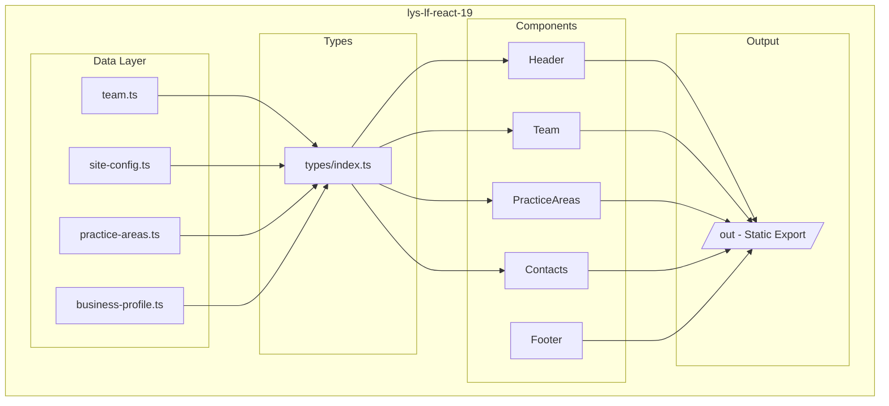

# LYS Law Firm - Website Repository

Professional website for LYS Law Firm, a full-service law firm based in the Philippines.

## Project

| Folder | Description |
|--------|-------------|
| `lys-lf-react-19/` | **Active** - Next.js 16 + React 19 implementation |

## Quick Start

```bash
cd lys-lf-react-19
npm install
npm run dev
```

Open [http://localhost:3000](http://localhost:3000)

## Production Build

```bash
cd lys-lf-react-19
npm run build
```

Static files generated in `lys-lf-react-19/out/` - deploy to Apache/Nginx.

## Architecture Overview



## Tech Stack

- **Next.js 16** - Framework with static export
- **React 19** - UI library
- **TypeScript** - Type safety
- **Tailwind CSS** - Styling
- **Google Maps API** - Location map

## Design Principles

This project follows **SOLID principles** and **Clean Code** practices:

- **Single Responsibility**: Data, types, and components are separated
- **Open/Closed**: Add team members or practice areas without modifying components
- **DRY**: Centralized configuration in `data/` folder

See `lys-lf-react-19/README.md` for detailed architecture documentation.

## Deployment

Static export works on any web server:

1. Run `npm run build` in `lys-lf-react-19/`
2. Upload contents of `out/` folder to web root
3. No Node.js runtime required

## License

Private - LYS Law Firm
